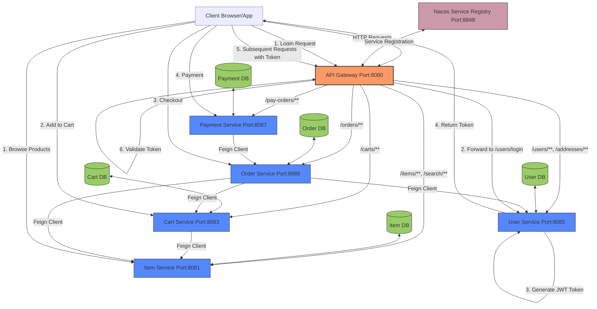

# eMall Microservices Architecture

## Overview
The eMall application is built using a microservices architecture, with each service responsible for a specific business domain. The services communicate with each other through REST APIs using Feign clients, and service discovery is handled by Nacos.

## Components

### API Gateway (Port: 8080)
- Acts as the entry point for all client requests
- Routes requests to appropriate microservices based on path patterns
- Handles authentication and authorization using JWT tokens
- Implemented using Spring Cloud Gateway

### Service Registry (Nacos Port: 8848)
- Provides service discovery functionality
- All microservices register themselves with Nacos
- Enables dynamic service-to-service communication

### User Service (Port: 8085)
- Handles user authentication and profile management
- Endpoints: `/users/**`, `/addresses/**`
- Features:
  - User registration and login
  - JWT token generation
  - User profile management
  - Address management

### Item Service (Port: 8081)
- Manages product catalog and search functionality
- Endpoints: `/items/**`, `/search/**`
- Features:
  - Product listing and details
  - Product search and filtering
  - Category management

### Cart Service (Port: 8083)
- Manages shopping cart functionality
- Endpoints: `/carts/**`
- Features:
  - Add/remove items from cart
  - Update quantities
  - List cart items
  - Communicates with Item Service to get product details

### Order Service (Port: 8086)
- Handles order processing
- Endpoints: `/orders/**`
- Features:
  - Create orders
  - Track order status
  - Order history
  - Communicates with Cart, Item, and User services

### Payment Service (Port: 8087)
- Manages payment processing
- Endpoints: `/pay-orders/**`
- Features:
  - Process payments
  - Payment status tracking
  - Communicates with Order service

## Authentication Flow
1. User sends login credentials to API Gateway
2. Gateway forwards request to User Service
3. User Service authenticates user and generates JWT token
4. Token is returned to client
5. Client includes token in subsequent requests
6. Gateway validates token before forwarding requests to services

## Shopping Flow
1. User browses products (Item Service)
2. User adds products to cart (Cart Service)
3. User proceeds to checkout (Order Service)
4. User completes payment (Payment Service)
5. Order is confirmed and processed

## Inter-Service Communication
- Services communicate using Feign clients
- Service discovery is handled by Nacos
- JWT tokens are passed between services for authentication

## Database Structure
Each service has its own dedicated database:
- User Service: mall-user
- Item Service: mall-item
- Cart Service: mall-cart
- Order Service: mall-trade
- Payment Service: mall-pay
